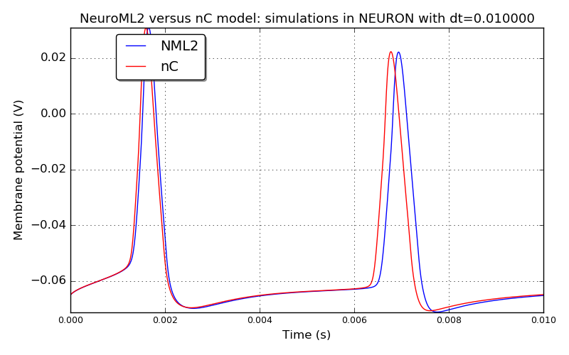
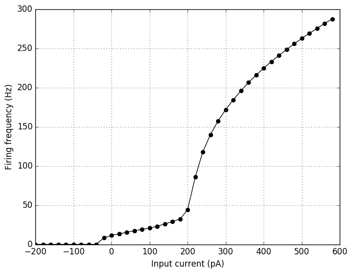
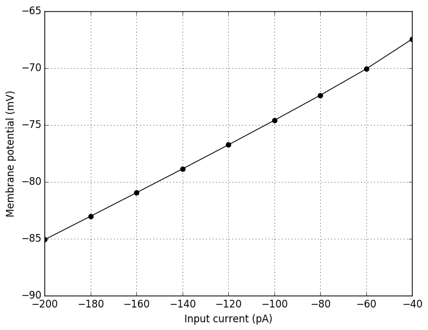
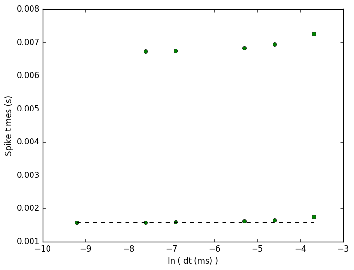
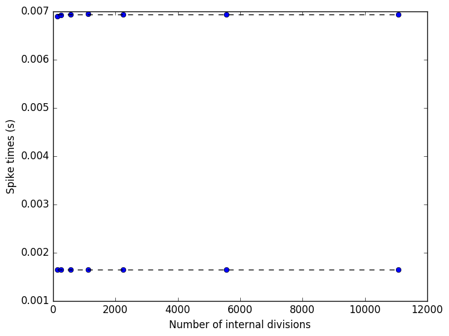

 
         
## Model: DeepAxAx

### Original neuroConstruct config ID: Cell11-deepaxax-10ms

**Comparison between the original nC model and NeuroML2 model: simulations in NEURON with dt=0.010000**

**IF curve for the NeuroML2 model simulated in NEURON**

**IV curve for the NeuroML2 model simulated in NEURON**

**Spike times versus time step: the NeuroML2 model simulated in NEURON.
Dashed black lines - spike times at the 0.005 ms time step; Green - spike times for the following time steps (in ms): [0.005, 0.01, 0.025].**

**Spike times versus spatial discretization: the NeuroML2 model simulated in NEURON.
Default value for the number of internal divs is 1130.
Dashed black lines - spike times at the 1130 internal divisions; Blue - spike times at the following values of internal divisions:
[141, 260, 1130].**

