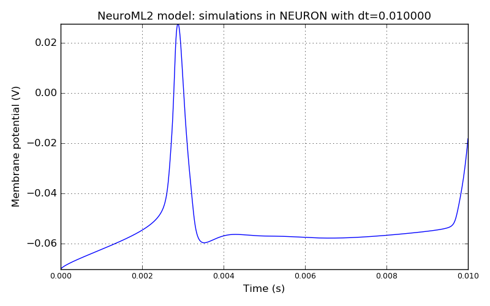

 
         
## Model: L23PyrFRB

### Original neuroConstruct config ID: Cell2-suppyrFRB-10ms

**NeuroML2 model: simulations in NEURON with dt=0.010000**

### Original neuroConstruct config ID: Cell2-suppyrFRB-FigA1FRB

**NeuroML2 model: simulations in NEURON with dt=0.010000**

**IF curve for the NeuroML2 model simulated in NEURON**

**IV curve for the NeuroML2 model simulated in NEURON**

**Spike times versus time step: the NeuroML2 model simulated in NEURON.
Dashed black lines - spike times at the smallest dt; Green - spike times for all time steps.**

**Spike times versus spatial discretization: the NeuroML2 model simulated in NEURON.
Default value for the number of internal divs is 763.
Dashed black lines - spike times at the maximum number of compartments; Blue - spike times for all discretization values.**

