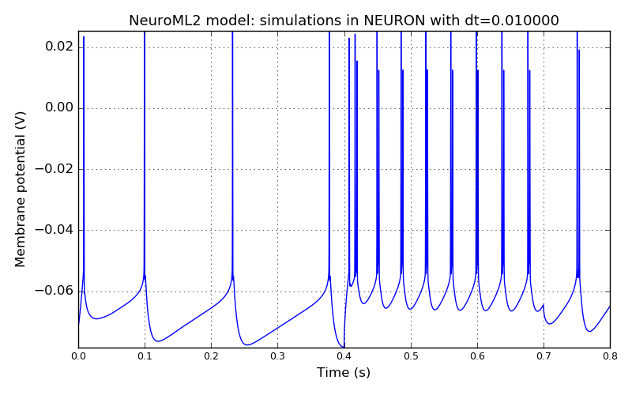
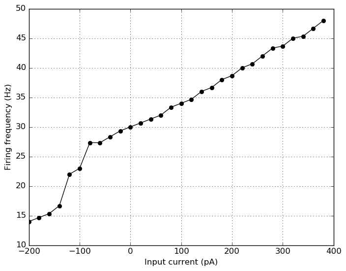
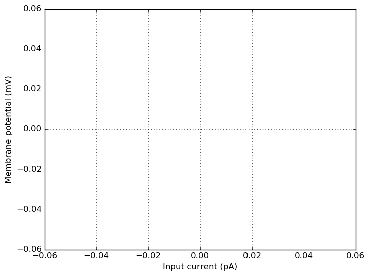
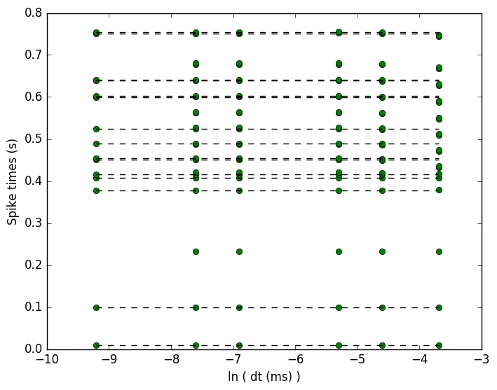
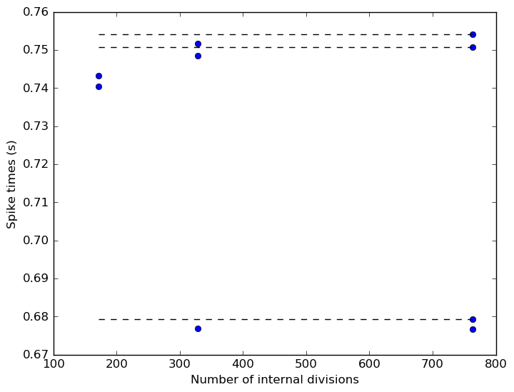

 
         
## Model: L23PyrFRB

### Original neuroConstruct config ID: Cell2-suppyrFRB-10ms

**NeuroML2 model: simulations in NEURON**

### Original neuroConstruct config ID: Cell2-suppyrFRB-FigA1FRB

**NeuroML2 model: simulations in NEURON**

**IF curve for the NeuroML2 model simulated in NEURON**

**IV curve for the NeuroML2 model simulated in NEURON**

**Spike times versus dt curve for the NeuroML2 model simulated in NEURON**

**Spike times versus spatial discretization: default value for the number of internal divs is 763**

