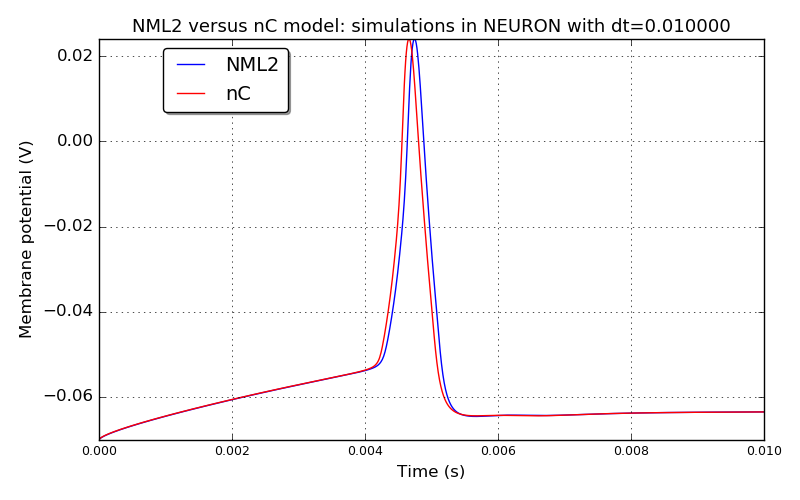
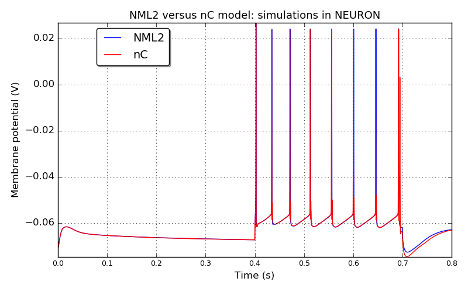
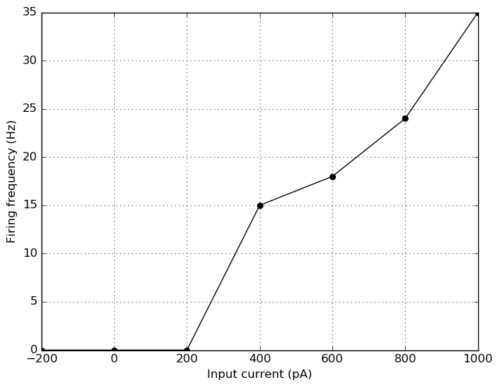
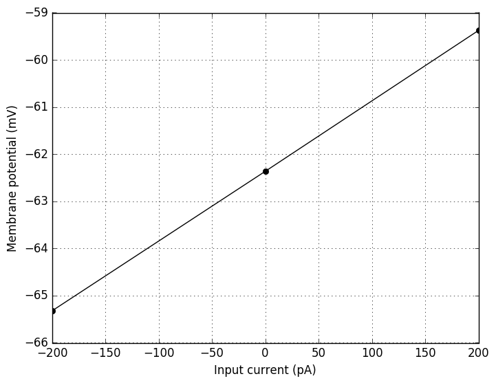
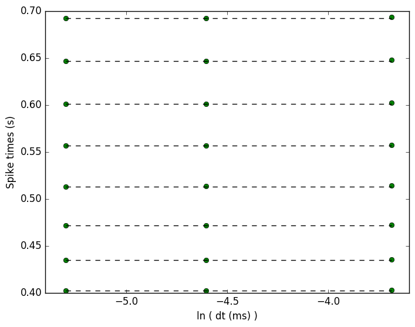
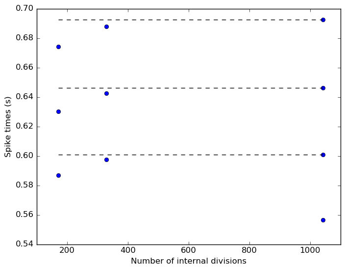

 
         
## Model: L23PyrRS

### Original neuroConstruct config ID: Cell1-supppyrRS-10ms

**Comparison between the original nC model and NeuroML2 model: simulations in NEURON**

### Original neuroConstruct config ID: Cell1-supppyrRS-FigA1RS

**Comparison between the original nC model and NeuroML2 model: simulations in NEURON**

**IF curve for the NeuroML2 model simulated in NEURON**

**IV curve for the NeuroML2 model simulated in NEURON**

**Spike times versus dt curve for the NeuroML2 model simulated in NEURON**

**Spike times versus spatial discretization**

