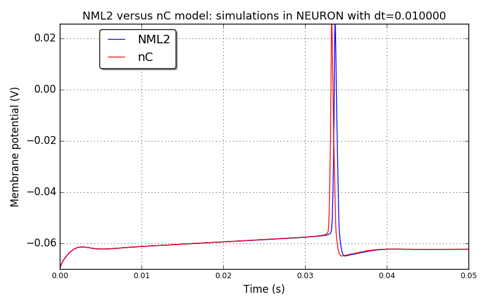
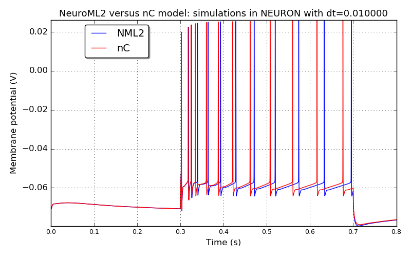
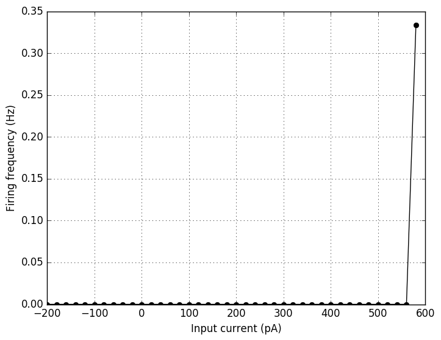
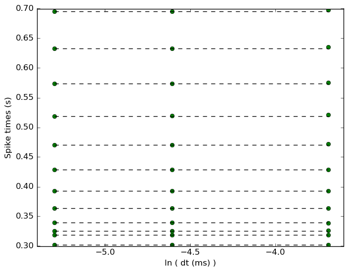
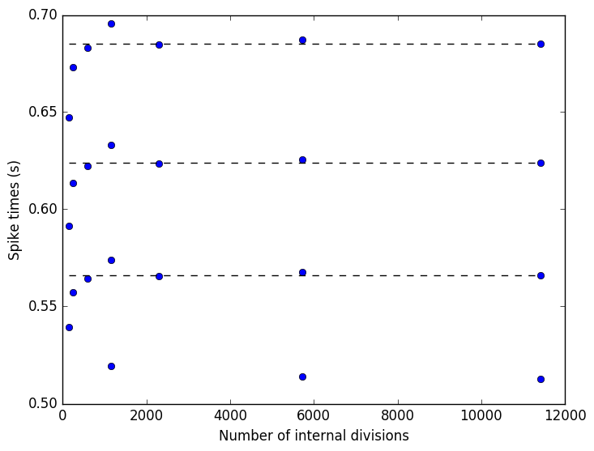

 
         
## Model: L6NonTuftedPyrRS

### Original neuroConstruct config ID: Cell9-nontuftRS-10ms

**Comparison between the original nC model and NeuroML2 model: simulations in NEURON with dt=0.010000**

### Original neuroConstruct config ID: Cell9-nontuftRS-FigA6-1000

**Comparison between the original nC model and NeuroML2 model: simulations in NEURON with dt=0.010000**

**IF curve for the NeuroML2 model simulated in NEURON**

**IV curve for the NeuroML2 model simulated in NEURON**

**Spike times versus time step: the NeuroML2 model simulated in NEURON.
Dashed black lines - spike times at the 0.0001 ms time step; Green - spike times at the following time steps (in ms): [0.0001, 0.0005, 0.001, 0.005, 0.01, 0.025].**

**Spike times versus spatial discretization: the NeuroML2 model simulated in NEURON.
Default value for the number of internal divs is 1165.
Dashed black lines - spike times at the 11423 internal divisions; Blue - spike times at the following values of internal divisions:
[142, 252, 593, 1165, 1165, 2304, 5724, 11423].**

