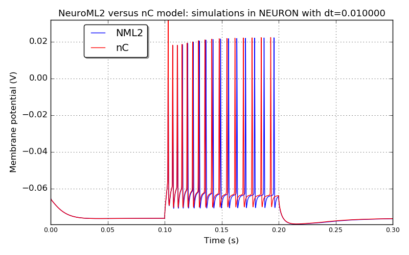
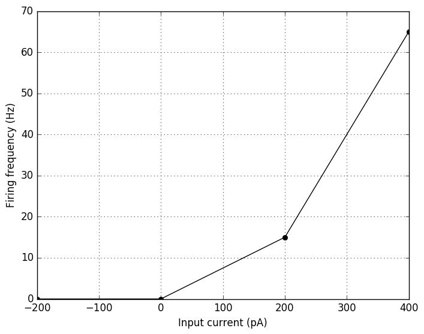
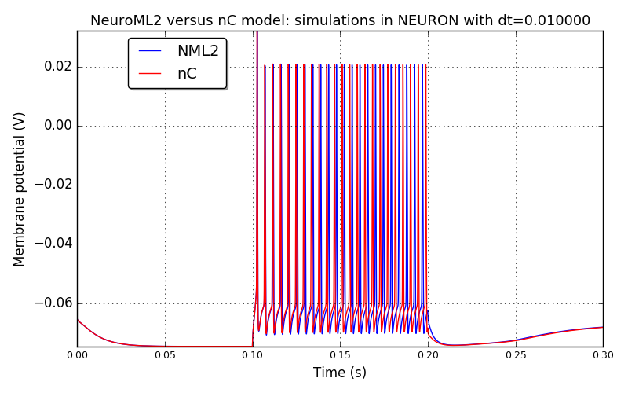
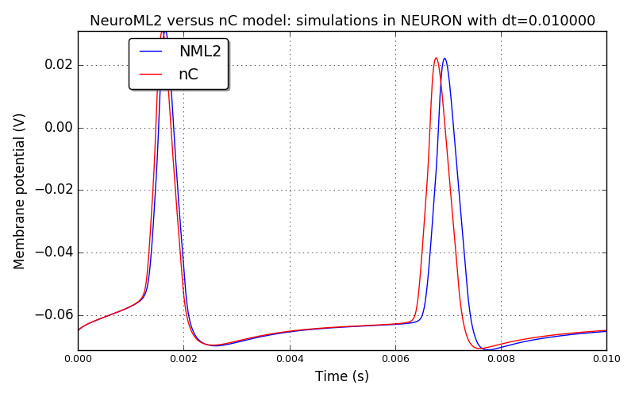
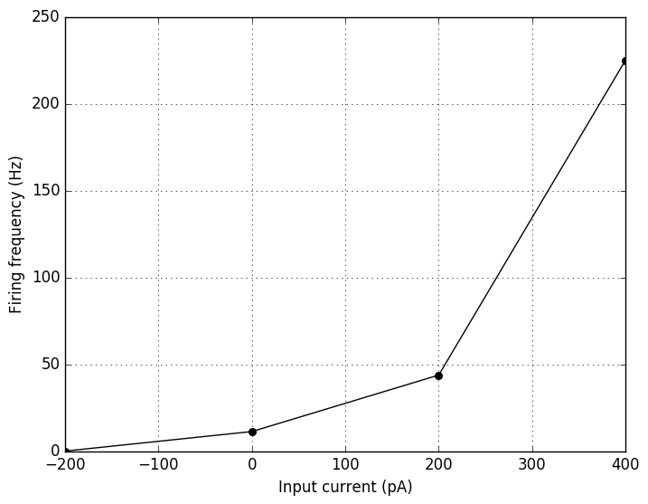
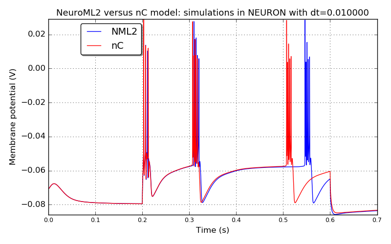
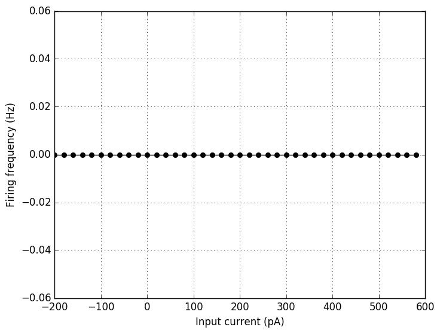
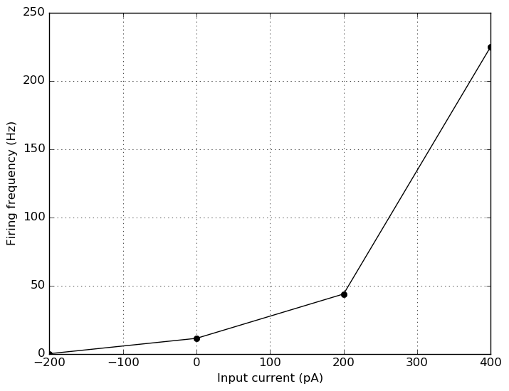
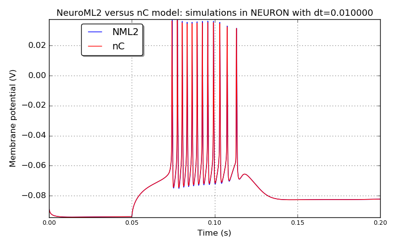
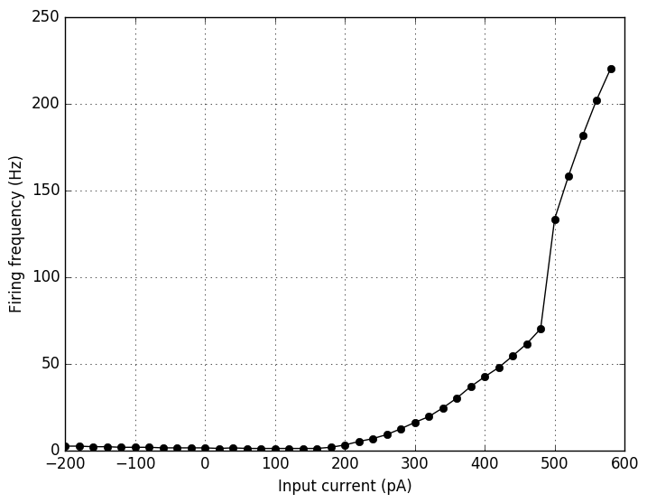

 
      
## Conversion of Thalamocortical cell models to NeuroML2

           
## Model: DeepLTSInter

### Original neuroConstruct config ID: Cell12-deepLTS-FigA2b

**Comparison between the original nC model and NeuroML2 model: simulations in NEURON with dt=0.010000**

**IF curve for the NeuroML2 model simulated in NEURON**

           
## Model: SupBasket

### Original neuroConstruct config ID: Cell3-supbask-FigA2a

**Comparison between the original nC model and NeuroML2 model: simulations in NEURON with dt=0.010000**

**IF curve for the NeuroML2 model simulated in NEURON**

           
## Model: L6NonTuftedPyrRS

### Original neuroConstruct config ID: Cell9-nontuftRS-FigA6-1000

**Comparison between the original nC model and NeuroML2 model: simulations in NEURON with dt=0.010000**

**IF curve for the NeuroML2 model simulated in NEURON**

           
## Model: DeepBasket

### Original neuroConstruct config ID: Cell10-deepbask-10ms

**Comparison between the original nC model and NeuroML2 model: simulations in NEURON with dt=0.010000**

**IF curve for the NeuroML2 model simulated in NEURON**

           
## Model: L23PyrRS

### Original neuroConstruct config ID: Cell1-supppyrRS-FigA1RS

**Comparison between the original nC model and NeuroML2 model: simulations in NEURON with dt=0.010000**

**IF curve for the NeuroML2 model simulated in NEURON**

           
## Model: L5TuftedPyrRS

### Original neuroConstruct config ID: Cell8-tuftRS-Fig5A-1400

**Comparison between the original nC model and NeuroML2 model: simulations in NEURON with dt=0.010000**

**IF curve for the NeuroML2 model simulated in NEURON**

           
## Model: SupLTSInter

### Original neuroConstruct config ID: Cell5-supLTS-FigA2b

**Comparison between the original nC model and NeuroML2 model: simulations in NEURON with dt=0.010000**

**IF curve for the NeuroML2 model simulated in NEURON**

           
## Model: L5TuftedPyrIB

### Original neuroConstruct config ID: Cell7-tuftIB-FigA4-1300

**Comparison between the original nC model and NeuroML2 model: simulations in NEURON with dt=0.010000**

**IF curve for the NeuroML2 model simulated in NEURON**

           
## Model: DeepAxAx

### Original neuroConstruct config ID: Cell11-deepaxax-10ms

**Comparison between the original nC model and NeuroML2 model: simulations in NEURON with dt=0.010000**

**IF curve for the NeuroML2 model simulated in NEURON**

           
## Model: SupAxAx

### Original neuroConstruct config ID: Cell4-supaxax-FigA2a

**Comparison between the original nC model and NeuroML2 model: simulations in NEURON with dt=0.010000**

**IF curve for the NeuroML2 model simulated in NEURON**

           
## Model: L23PyrFRB

### Original neuroConstruct config ID: Cell2-suppyrFRB-FigA1FRB

**Comparison between the original nC model and NeuroML2 model: simulations in NEURON with dt=0.010000**

**IF curve for the NeuroML2 model simulated in NEURON**

           
## Model: nRT

### Original neuroConstruct config ID: Cell14-nRT-FigA8-00

**Comparison between the original nC model and NeuroML2 model: simulations in NEURON with dt=0.010000**

**IF curve for the NeuroML2 model simulated in NEURON**

