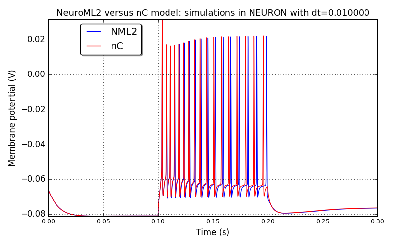
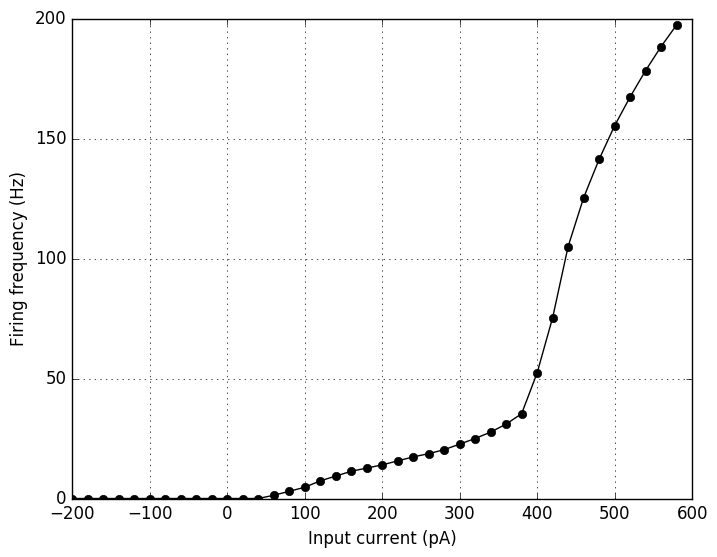
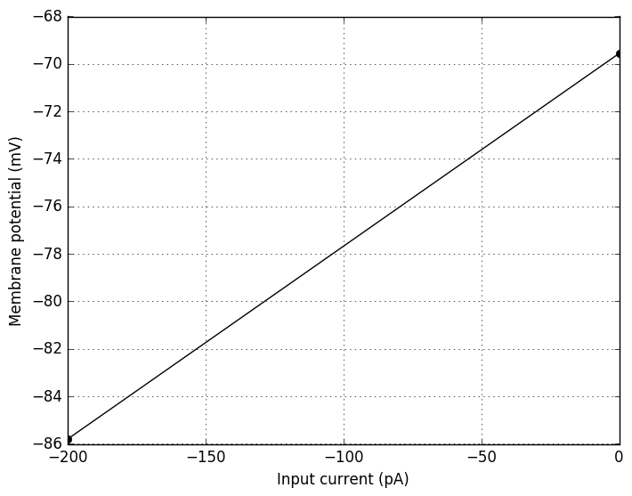
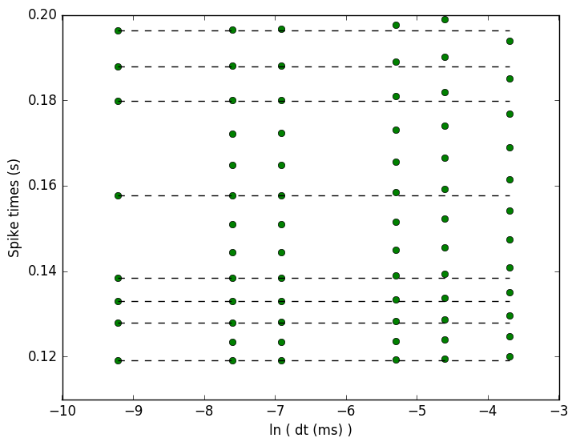
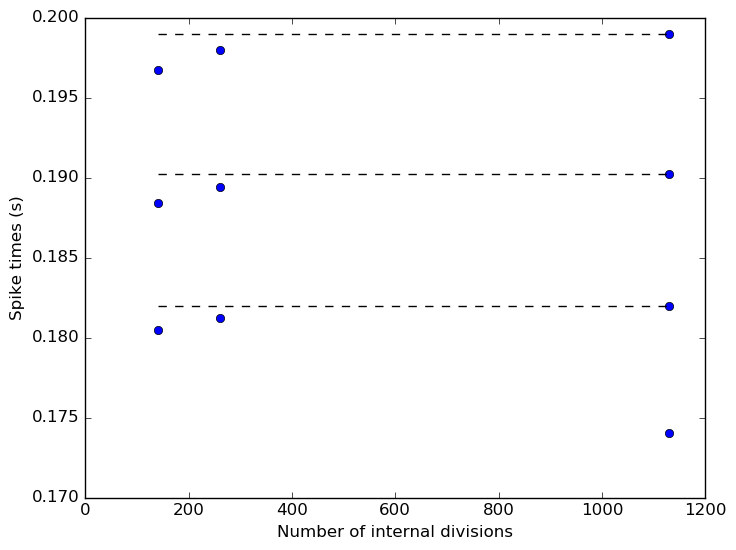

 
         
## Model: SupLTSInter

### Original neuroConstruct config ID: Cell5-supLTS-10ms

**Comparison between the original nC model and NeuroML2 model: simulations in NEURON with dt=0.010000**

### Original neuroConstruct config ID: Cell5-supLTS-FigA2b

**Comparison between the original nC model and NeuroML2 model: simulations in NEURON with dt=0.010000**

**IF curve for the NeuroML2 model simulated in NEURON**

**IV curve for the NeuroML2 model simulated in NEURON**

**Spike times versus time step: the NeuroML2 model simulated in NEURON.
Dashed black lines - spike times at the 0.0001 ms time step; Green - spike times at the following time steps (in ms): [0.0001, 0.0005, 0.001, 0.005, 0.01, 0.025].**

**Spike times versus spatial discretization: the NeuroML2 model simulated in NEURON.
Default value for the number of internal divs is 1130.
Dashed black lines - spike times at the 11068 internal divisions; Blue - spike times at the following values of internal divisions:
[141, 260, 573, 1130, 1130, 2239, 5555, 11068].**

